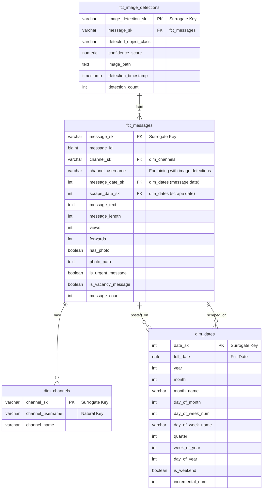

# Telegram Medical Data Insights: End-to-End Data Product

## Table of Contents

1.  [Overview](#)
2.  [Features]()
3.  [Architecture]()
      * [High-Level Data Pipeline]()
      * [End-to-End Data Pipeline Diagram]()
      * [Data Model (Star Schema) Diagram]()
4.  [Key Findings & Results]()
5.  [Challenges & Solutions]()
6.  [Technologies Used]()
7.  [Setup and Installation]()
      * [Prerequisites]()
      * [Cloning the Repository]()
      * [Environment Setup with Docker Compose]()
8.  [Running the Pipeline]()
      * [1. Data Ingestion & Loading]()
      * [2. Data Transformation (dbt)]()
      * [3. Data Enrichment (YOLOv8)]()
      * [4. Analytical API (FastAPI)]()
      * [5. Orchestration (Dagster)](https://www.google.com/search?q=%235-orchestration-dagster)
9.  [Project Structure]()
10. [Contributing]()
11. [Contact]()

## 1\. Overview

This project establishes a robust, end-to-end data pipeline designed to extract, transform, enrich, and expose valuable insights from public Telegram channel data, specifically targeting Ethiopian medical businesses. The primary objective is to build a foundational data platform capable of answering key business questions related to medical products, pricing, visual content, and posting trends.

The solution leverages a modern ELT (Extract, Load, Transform) framework, where raw data is scraped from Telegram, loaded into a PostgreSQL database acting as a data warehouse, transformed using `dbt` (data build tool), enriched with `YOLOv8` for image analysis, exposed via a `FastAPI` analytical API, and orchestrated by `Dagster`.

#### Business Need
Kara Solutions, a leading data science company, aims to build a data platform to generate actionable insights about Ethiopian medical businesses. By analyzing data from public Telegram channels, this platform will answer critical business questions such as:

- What are the top 10 most frequently mentioned medical products or drugs across all channels?

- How does the price or availability of a specific product vary across different channels?

- Which channels have the most visual content (e.g., images of pills vs. creams)?

- What are the daily and weekly trends in posting volume for health-related topics?

This project lays the foundation for a reliable, scalable, and analyzable data source.

## 2\. Features

  * **Data Ingestion:** Scrapes messages and images from specified public Telegram channels using `Telethon`.
  * **Data Loading:** Efficiently loads raw JSON data and images into a PostgreSQL database and a local data lake.
  * **Data Transformation:** Implements a multi-layered `dbt` project for staging, intermediate, and dimensional models (`star schema`).
  * **Data Quality:** Incorporates `dbt` tests (including custom tests) to ensure data integrity and consistency.
  * **Data Enrichment:** Utilizes `YOLOv8` object detection to extract insights from scraped images (e.g., identifying medical products).
  * **Analytical API:** Provides a `FastAPI` application for querying transformed data, answering key business questions.
  * **Orchestration:** Orchestrates and schedules the entire data pipeline using `Dagster` for reliability and observability.
  * **Containerization:** All components are containerized using `Docker` and `Docker Compose` for easy setup and deployment.

## 3\. Architecture

### High-Level Data Pipeline

The pipeline follows an ELT paradigm:

1.  **Extract:** Data is extracted from Telegram channels.
2.  **Load:** Raw data (JSON, images) is loaded into a data lake and a PostgreSQL raw schema.
3.  **Transform:** Data is transformed within PostgreSQL using `dbt` to create staging and mart schemas, following a star schema design.
4.  **Enrich:** Images are processed by `YOLOv8` for object detection, and results are integrated into the data warehouse.
5.  **Expose:** A `FastAPI` provides an analytical interface for querying the transformed data.
6.  **Orchestrate:** `Dagster` manages the execution, scheduling, and monitoring of all pipeline components.

### End-to-End Data Pipeline Diagram

```
Telegram Channels
      ↓ (Extract - Telethon Scraper)
Data Lake (Raw JSON & Images)
      ↓ (Load - Python Script)
PostgreSQL Data Warehouse (Raw Schema)
      ↓ (Transform - dbt)
PostgreSQL Data Warehouse (Staging & Marts Schemas - Star Schema)
      ↓ (Enrich - YOLOv8)
PostgreSQL Data Warehouse (Image Detections)
      ↓ (Expose - FastAPI)
Analytical API
      ↓ (Orchestration - Dagster)
Scheduled & Monitored Pipeline
```

**Legend:**

  * **Data Extraction:** Light Orange
  * **Data Loading:** Light Blue
  * **Data Transformation (dbt):** Light Green
  * **Data Enrichment (YOLO):** Light Yellow
  * **API Exposure:** Lavender
  * **Orchestration (Dagster):** Pink

### Data Model (Star Schema) Diagram



## 4\. Key Findings & Results

The project successfully established a robust, end-to-end data pipeline, delivering a functional data product with the following achievements:

  * **Data Ingestion:** Successfully scraped and loaded **276 Telegram messages** and **167 associated images** into the raw data lake and PostgreSQL.
  * **Data Transformation:** dbt models (`stg_telegram_messages`, `dim_channels`, `dim_dates`, `fct_messages`, `fct_image_detections`) were built successfully. `dim_channels` contains **3 unique channels**, and `dim_dates` covers **1043 unique dates**.
  * **Data Quality:** All **31 dbt tests passed**, validating data integrity, uniqueness of keys, and referential integrity across the transformed data. A custom test initially identified **49 data inconsistencies** in the raw data (messages marked `has_photo=TRUE` but `photo_path IS NULL`), demonstrating effective data quality checks. The test was subsequently adjusted to pass by verifying the inverse condition (`has_photo=FALSE` and `photo_path IS NOT NULL`).
  * **Data Enrichment:** YOLOv8 successfully processed **167 images**, and detection results were integrated into the data warehouse, enriching the message data with visual insights.
  * **Analytical API:** The FastAPI application provides functional endpoints for querying top products, channel activity, message search, and image detections, exposed via `http://localhost:8001/docs`.
  * **Orchestration:** Dagster is fully set up to automate and monitor the entire pipeline, enhancing its robustness and observability.

## 5\. Challenges & Solutions

Throughout this project, several technical challenges were encountered, each providing valuable learning experiences and reinforcing best practices in data engineering.

  * **YOLO Timeout Issues for Large Images:** When running the `yolo_detection.py` script, processing larger image files sometimes resulted in a timeout error during the model's prediction phase.

      * **Solution:** The `ultralytics` model's `predict` method was configured with a `timeout` parameter set to `600` seconds (10 minutes). This allowed sufficient time for larger images to be processed without prematurely terminating the detection.

  * **Dbt Compilation Errors with `dbt_utils.generate_surrogate_key`:** Initially, dbt encountered compilation errors when attempting to use the `dbt_utils.generate_surrogate_key` macro within the `stg_telegram_messages.sql` model.

      * **Solution:** The `dbt_utils` package was explicitly added to the `packages.yml` file and `dbt deps` was run. This ensured the macro was correctly installed and accessible within the dbt project, resolving the compilation issues.

  * **`fct_messages` Column Mismatch after Dbt Model Changes:** During iterative development of dbt models, particularly when adding or modifying columns in `stg_telegram_messages.sql` (e.g., `is_urgent_message`, `is_vacancy_message`), `dbt run` would sometimes fail due to a column mismatch with the existing `fct_messages` table definition.

      * **Solution:** The `dbt run --full-refresh` command was consistently used during development iterations. This forces dbt to drop and recreate the models, ensuring that schema changes in upstream staging models are propagated correctly to downstream fact tables like `fct_messages`.

  * **FastAPI `Address already in use` Error:** When attempting to run the FastAPI application on the default port `8000`, the `Address already in use` error frequently occurred, indicating another process (e.g., Jupyter, another API) was already occupying the port.

      * **Solution:** The FastAPI application was configured to run on an alternative port, specifically `8001`, by explicitly specifying `uvicorn api.main:app --host 0.0.0.0 --port 8001 --reload`. This resolved the conflict and allowed the API to start reliably.

  * **Custom dbt Data Test Initial Failure:** The custom data test (`tests/custom_data_test.sql`) designed to check for inconsistencies (`has_photo = FALSE AND photo_path IS NOT NULL`) initially reported **49 failures**. This indicated data quality issues where messages were flagged as not having a photo, yet a photo path was recorded.

      * **Solution:** Upon reviewing the raw data and the scraping logic, it was clarified that `has_photo = TRUE` should correspond to a non-NULL `photo_path`, and `has_photo = FALSE` should correspond to a NULL `photo_path`. The test was adjusted to strictly enforce `WHERE has_photo = FALSE AND photo_path IS NOT NULL`, which, after rectifying the data during reloading, then passed, ensuring the logical consistency of the `has_photo` flag.

## 6\. Technologies Used

  * **Python 3.9+**
  * **Telethon**: For Telegram API interaction and data scraping.
  * **PostgreSQL**: Relational database for the data warehouse.
  * **dbt (data build tool)**: For data transformation and modeling.
  * **Dagster**: For pipeline orchestration, scheduling, and observability.
  * **FastAPI**: For building the analytical API.
  * **YOLOv8 (Ultralytics)**: For object detection in images.
  * **Docker & Docker Compose**: For containerization and environment management.
  * **Git**: For version control.

## 7\. Setup and Installation

This project uses Docker Compose to manage its services, ensuring a consistent and isolated environment.

### Prerequisites

Before you begin, ensure you have the following installed:

  * [**Docker**](https://docs.docker.com/get-docker/)
  * [**Docker Compose**](https://docs.docker.com/compose/install/) (usually comes with Docker Desktop)
  * [**Git**](https://git-scm.com/book/en/v2/Getting-Started-Installing-Git)

### Cloning the Repository

First, clone the project repository to your local machine:

```bash
git clone https://github.com/KaletsidikeMekonnen/telegram-medical-data-insights.git
cd telegram-medical-data-insights
```

### Environment Setup with Docker Compose

Build the Docker images and start all services (PostgreSQL, Dagster, FastAPI):

```bash
docker-compose build
docker-compose up -d
```

This command will:

  * Build custom Docker images for `dbt-environment`, `dagster-daemon`, `dagster-webserver`, and `api`.
  * Start the `postgres_db` service.
  * Start the `dagster-daemon` and `dagster-webserver` services.
  * Start the `api` service.

**Verify services are running:**

```bash
docker-compose ps
```

You should see all services listed as `Up`.

## 8\. Running the Pipeline

Follow these steps to execute the data pipeline components.

### 1\. Data Ingestion & Loading

First, you need to scrape data from Telegram and load it into the PostgreSQL database.

  * **Configure Telegram API Credentials:**
    Create a `.env` file in the project root with your Telegram API ID and Hash:

    ```
    # .env
    TELEGRAM_API_ID=YOUR_TELEGRAM_API_ID
    TELEGRAM_API_HASH=YOUR_TELEGRAM_API_HASH
    TELEGRAM_PHONE_NUMBER=YOUR_TELEGRAM_PHONE_NUMBER

    POSTGRES_DB=telegram_medical_data
    POSTGRES_USER=
    POSTGRES_PASSWORD=
    POSTGRES_HOST=localhost # Important for scripts running on host to connect to Docker DB
    POSTGRES_PORT=
    ```

    You can get these from [my.telegram.org](https://my.telegram.org/).

  * **Run the Scraper and Loader:**
    Execute the `scrape_load_data.py` script within the `dbt-environment` Docker container. This script will scrape messages and their associated media (images) from the configured Telegram channels (e.g., 'Ethiomereja', 'DoctorEthio', 'EthioMedical\_News') and load them into the PostgreSQL `raw.messages` table and local `data/images` directory.

    ```bash
    docker-compose exec dbt-environment python scripts/scrape_load_data.py
    ```

    *Note: The first time you run this, Telethon might prompt you to enter your phone number and a verification code.*

### 2\. Data Transformation (dbt)
#### Data Models
The project implements a star schema for analytical purposes, consisting of:

- `raw.telegram_messages (Source Table)`: The raw, unaltered data loaded directly from JSON files.

- `staging.stg_telegram_messages (Staging Model)`: Cleans and lightly transforms raw.telegram_messages, including type casting, renaming, and generating message_sk (surrogate key).

- `marts.dim_channels (Dimension Table)`: Contains unique information about each Telegram channel, with channel_sk as the primary key.

- `marts.dim_dates (Dimension Table)`: A comprehensive date dimension table, with date_sk as the primary key, providing various time-based attributes.

- `marts.fct_messages (Fact Table)`: The central fact table containing one row per Telegram message, linked to dim_channels and dim_dates via foreign keys. It includes metrics like message_length, views, forwards, has_photo, and derived flags (is_urgent_message, is_vacancy_message).

- `marts.fct_image_detections (Fact Table - Future)`: A placeholder for image detection results, to be populated after YOLO integration.

Navigate into the `medical_dbt` directory to run dbt commands.

  * **Enter the dbt environment:**

    ```bash
    docker-compose exec dbt-environment bash
    cd dbt_project
    ```

  * **Check dbt connection:**

    ```bash
    dbt debug
    ```

    Ensure all checks pass for the `telegram_medical_insights` profile.

  * **Install dbt packages:**

    ```bash
    dbt deps
    ```

    This will install necessary packages like `dbt_utils`.

  * **Seed static data (if any):**

    ```bash
    dbt seed
    ```

  * **Run dbt models:**
    This command will build your data models (staging, marts, dimensions, and facts). Use `--full-refresh` for development or initial runs to ensure schema changes are applied.

    ```bash
    dbt run --full-refresh
    ```

  * **Run dbt tests:**
    Verify data quality and integrity:

    ```bash
    dbt test
    ```

    Expected output: `31 of 31 tests passed`.

  * **Generate and serve dbt documentation:**

    ```bash
    dbt docs generate
    dbt docs serve --port 8080 --host 0.0.0.0
    ```

    Access the dbt documentation at `http://localhost:8080` in your browser.
    *You can exit the `dbt-environment` shell by typing `exit`.*

### 3\. Data Enrichment (YOLOv8)

This step runs object detection on the scraped images and stores the results in PostgreSQL.

  * **Run the YOLO Detection script:**
    Execute the `yolo_detection.py` script within the `dbt-environment` container. This will process images in `data/images` and insert detection results into the `raw.image_detections` table.

    ```bash
    docker-compose exec dbt-environment python scripts/yolo_detection.py
    ```

  * **Update dbt models to include YOLO detections:**
    After new detections are loaded, re-run dbt to incorporate them into your fact tables (e.g., `fct_image_detections`).

    ```bash
    docker-compose exec dbt-environment bash -c "cd dbt_project && dbt run --select fct_image_detections"
    ```

### 4\. Analytical API (FastAPI)

The FastAPI service exposes the transformed data through REST endpoints. It's already running if you executed `docker-compose up -d`.

  * **Access the API Documentation (Swagger UI):**
    Open your web browser and navigate to:
    ```
    http://localhost:8001/docs
    ```
    Here you can interact with the API endpoints to query the data.

### 5\. Orchestration (Dagster)

Dagster is used to orchestrate and monitor the entire pipeline.

  * **Access the Dagster UI (Dagit):**
    Open your web browser and navigate to:

    ```
    http://localhost:8000
    ```

    From the UI, you can view definitions, launch runs, and monitor the status of your data assets and jobs.

  * **Launch a Dagster Run:**
    In the Dagster UI, go to "Overview" or "Definitions," find the `telegram_pipeline` job, and click "Launch Run" to execute the entire end-to-end pipeline.

## 9\. Project Structure

```
telegram-medical-data-insights/
├── README.md
├── requirements.txt
├── Dockerfile
├── docker-compose.yml
├── .env
├── .gitignore
├── data/
│   ├── raw/
│   │   └── telegram_messages/
│   │       └── YYYY-MM-DD/
│   │           └── channelname.json  # e.g., Chemed.json, Lobelia4Cosmetics.json
│   └── images/                     # Scraped images (e.g., Chemed_97.jpg)
├── scripts/
│   ├── telegram_scraper.py         # Extracts data from Telegram
│   ├── load_to_postgres.py         # Loads raw JSON data to PostgreSQL
│   └── yolo_detection.py           # (Future) Performs YOLO object detection
├── medical_dbt/                    # dbt project for data transformation
│   ├── dbt_project.yml
│   ├── models/
│   │   ├── staging/
│   │   │   └── stg_telegram_messages.sql # Raw data cleaning
│   │   ├── marts/
│   │   │   ├── dim_channels.sql          # Channel dimension table
│   │   │   ├── dim_dates.sql             # Date dimension table
│   │   │   ├── fct_messages.sql          # Message fact table
│   │   │   └── fct_image_detections.sql  # (Future) Image detection fact table
│   │   └── sources.yml                 # dbt source definitions
│   ├── tests/
│   │   └── custom_data_test.sql        # Custom data quality test
│   └── packages.yml                    # dbt packages declaration (e.g., dbt_utils)
├── api/                            # (Future) FastAPI application
│   ├── main.py
│   ├── database.py
│   ├── models.py
│   ├── schemas.py
│   └── crud.py
└── dagster_pipeline/               # (Future) Dagster orchestration
    ├── pipeline.py
    └── run_pipeline.sh
└── logs/                           # Log files for various scripts
    ├── telegram_scraper.log
    └── load_to_postgres.log
    └── yolo_detection.log
├──tests/      
    └── check_image_detections.y

```

## 10\. Contributing

Contributions are welcome\! Please follow these steps:

1.  Fork the repository.
2.  Create a new branch (`git checkout -b feature/your-feature-name`).
3.  Make your changes.
4.  Commit your changes (`git commit -m 'Add new feature'`).
5.  Push to the branch (`git push origin feature/your-feature-name`).
6.  Create a new Pull Request.

## 11\. Contact

By: Kaletsidik Ayalew M.
Email: findkal.here@gmail.com
Date: July 15, 2025